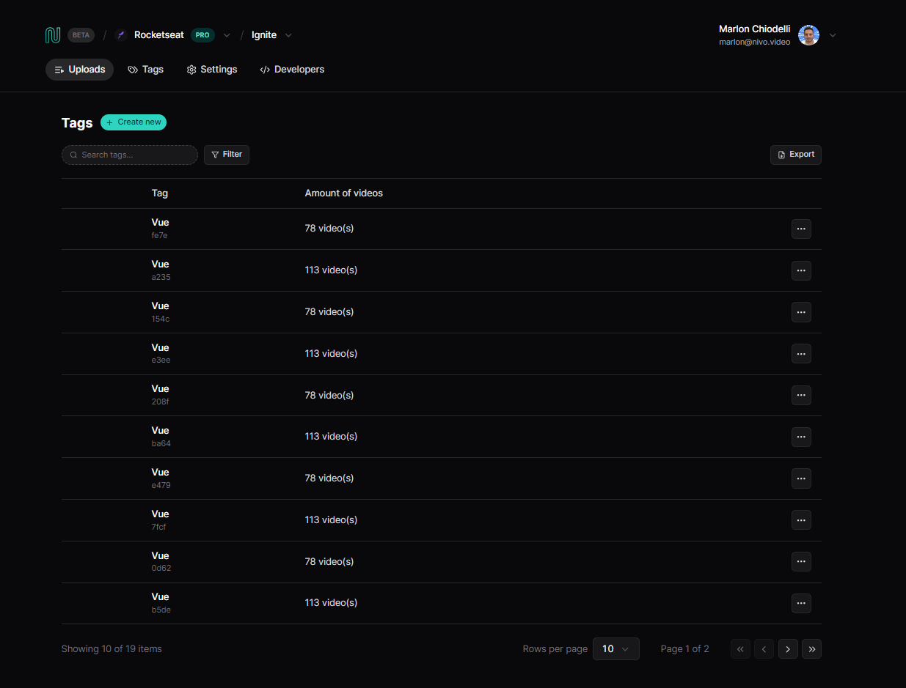

# Nivo

Essa aplicação foi desenvolvida durante o evento React na Prática da Rocketseat

## Executando

Após clonar o repositório, acesse a pasta do projeto e execute os comandos abaixo:

```sh
npm install
npm run dev
```

Abra outro terminal e execute:

```sh
npm run server
```

Acesse <http://localhost:5173> para visualizar a aplicação.